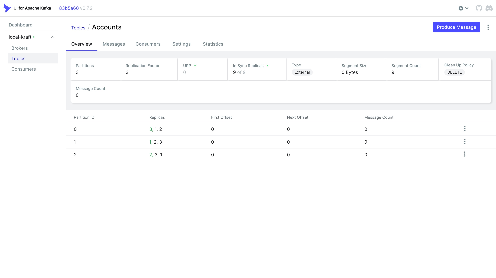
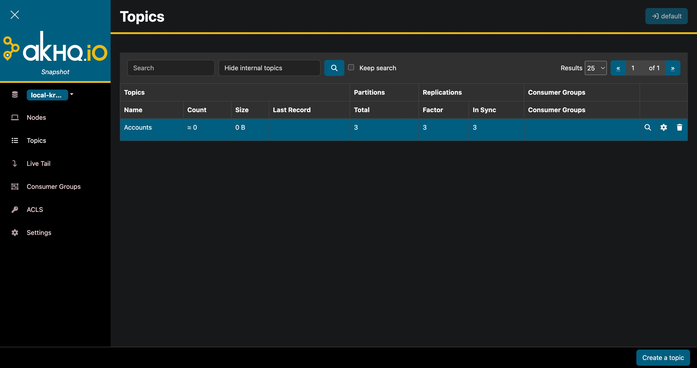

# Kafka Docker Compose

This project provides a Docker Compose setup for running a local Apache Kafka cluster using KRaft mode (without Zookeeper). It includes three Kafka brokers configured as a highly available cluster and a web-based UI for managing and monitoring the cluster.

## Services

The [docker-compose.yaml](./docker-compose.yaml) file spins up the following services:

### Kafka Brokers
- **kafka-1**: Kafka broker/controller node 1, accessible on host port `9094`
- **kafka-2**: Kafka broker/controller node 2, accessible on host port `9095`
- **kafka-3**: Kafka broker/controller node 3, accessible on host port `9096`

All brokers are configured to run in KRaft mode with:
- Shared cluster ID: `abcdefghijklmnopqrstuv`.
- 3-node controller quorum for fault tolerance.
- Replication factors set for high availability (default replication factor: 3, min in-sync replicas: 2).
- Plaintext listeners for local development.
- Automatic topic creation disabled.

### Kafka UI


- **kafka-ui**: Web-based UI for browsing topics, messages, partitions, and consumer groups.
- Accessible at http://localhost:8078.
- Connected to all three Kafka brokers for cluster management.

### AKHQ


- **akhq**: Alternative web-based UI for Kafka management and monitoring.
- Accessible at http://localhost:8079.
- Provides similar functionality to kafka-ui with a different interface.

## Usage

### Starting the Cluster
To start all services in detached mode:
```bash
docker-compose up -d
```

### Stopping the Cluster
To stop and remove all containers:
```bash
docker-compose down
```

To stop and remove containers along with volumes (this will delete persisted data):
```bash
docker-compose down -v
```

### Accessing Kafka
- **Bootstrap servers** for external clients: `localhost:9094,localhost:9095,localhost:9096`.
- Use any of the host ports to connect to the cluster.
- For Docker-internal communication, use `kafka-1:9092`, `kafka-2:9092`, `kafka-3:9092`.

### Accessing the UI
Open your browser and navigate to http://localhost:8078 to access the Kafka UI or http://localhost:8079 for AKHQ.

## Configuration Notes

- **KRaft Mode**: This setup uses Apache Kafka's KRaft (Kafka Raft) metadata mode, eliminating the need for Zookeeper.
- **No Schema Registry**: This Compose file does not include a schema registry because the standard Apache Kafka images do not provide one.
- **Schema handling**: The brokers do not require messages to include a schema ID.
- **Schema ID behavior**: If a producer includes a schema ID, Kafka itself will not validate it against any registry or schema store.
- **Persistence**: Data is persisted in named Docker volumes (`kafka_1_`, `kafka_2_`, `kafka_3_`).
- **Security**: Plaintext listeners are used for local development only. Do not use this configuration in production.
- **Ports**: Host ports 9094-9096 are exposed for Kafka brokers, 8078 for Kafka UI, and 8079 for AKHQ.

## Prerequisites

- Docker and Docker Compose installed on your system.
- At least 4GB of available RAM (recommended for running 3 Kafka brokers).

## Troubleshooting

- If containers fail to start, ensure no other services are using ports 9094-9096, 8078, or 8079.
- Check container logs with `docker-compose logs <service-name>`.
- For Kafka connection issues, verify the bootstrap servers configuration in your client applications.